# CafeDL
Design and implementation of a small DeepLearning library from scratch in Java, inspired by Keras and the book "Deep Learning From Scratch" by O'Reilly. The goal is to apply the main OOP Design Patterns and UML diagramming in a software project.
## Introduction

As a project for the Software Design and Databases courses at university, I created and executed a project for a game inspired by [QuickDraw](https://quickdraw.withgoogle.com/), where a neural network attempts to classify your hand-drawn sketches. 

Because of this, I decided to create a DeepLearning "library" from scratch in Java and use it in the game. By employing the main design patterns and best practices, I was inspired by the  [Keras](https://keras.io/) library and its Sequential API to create different architectures with the classic layers and operations of a neural network.

In the scope of databases, I used [MongoDB](https://www.mongodb.com/) and [Morphia](https://github.com/MorphiaOrg/morphia) for Object Document Mapping (ODM) and to persist the trained models.

---

## Neural Netowork

The "library" uses the [ND4J](https://deeplearning4j.konduit.ai/nd4j/tutorials/quickstart) library for tensor and matrix manipulation, utilizing NDArray as the main data structure. Similar to Numpy, the library allows for vectorized and efficient operations, enabling its use in somewhat more complex applications. There are certain redundancies in using this library, as it already possesses many of the operations and serves as the foundation for the algebraic operations of [DL4J](https://github.com/deeplearning4j/deeplearning4j). The idea was to implement the relevant mathematical parts while taking advantage of the data structure it provides.

### Examples

The examples package contains some use cases and tests for the library. The main ones are:
- [Classification](src/main/java/br/cafedl/neuralnetwork/examples/classification):
  - [Mnist](src/main/java/br/cafedl/neuralnetwork/examples/classification/image/mnist/MnistNN.java): A simple example of a neural network for classifying handwritten digits from the MNIST dataset.
      
  - [QuickDraw](src/main/java/br/cafedl/neuralnetwork/examples/classification/image/qdraw/QuickDrawNN.java): A neural network for classifying hand-drawn sketches from the QuickDraw dataset.

    
  https://github.com/user-attachments/assets/89a9018f-7fde-499f-98fc-78a282b8ec2f
  
  https://github.com/user-attachments/assets/51b63c3d-6666-4556-9917-fa72c03d1148
  
- [Regression](src/main/java/br/cafedl/neuralnetwork/examples/regression):
  - [Linear](src/main/java/br/cafedl/neuralnetwork/examples/regression/LinearRegression.java): A simple example of a neural network for linear regression.
  - [NonLinearFunctions](src/main/java/br/cafedl/neuralnetwork/examples/regression/NonLinearFunctions.java): A neural network for approximating non-linear functions, such as sine, saddle, rosenbrock, and others.

    <table>
        <tr>
            <td>
                <figure>
                    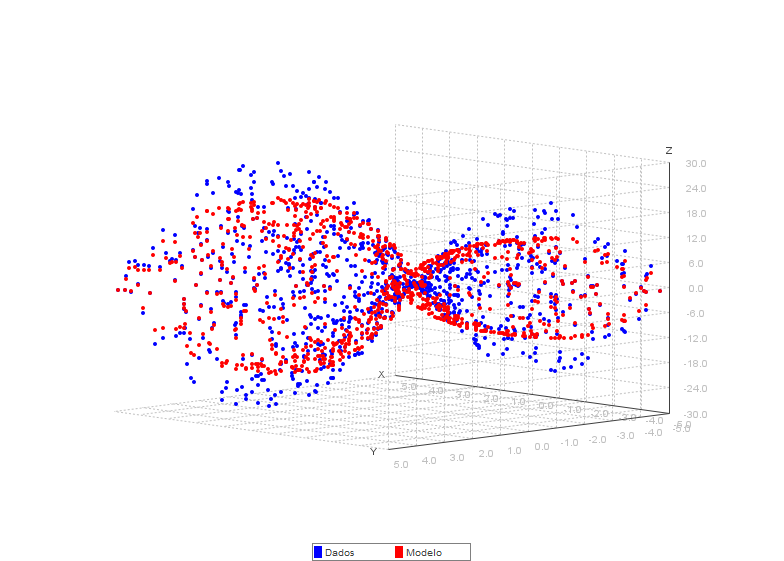
                    <figcaption>Saddle Function</figcaption>
                </figure>
            </td>
            <td>
                <figure>
                    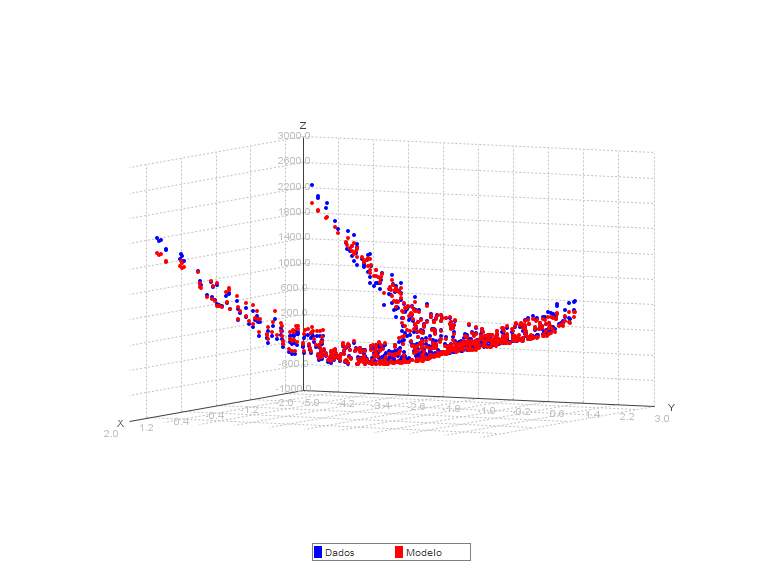
                    <figcaption>Rosenbrock Function</figcaption>
                </figure>
            </td>
        </tr>
        <tr>
            <td>
                <figure>
                    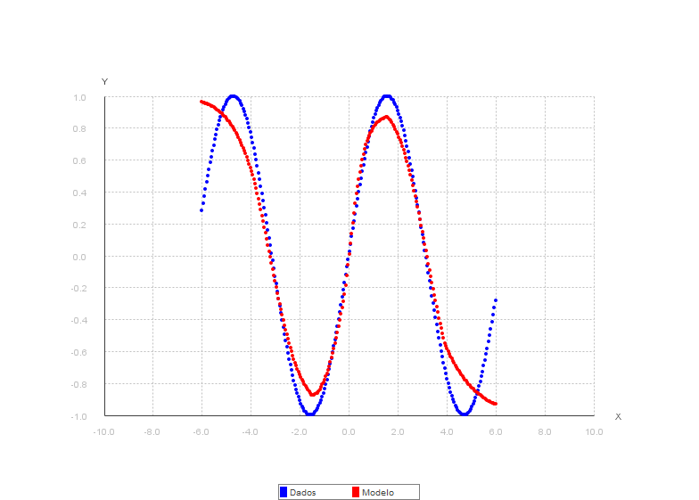
                    <figcaption>Sine Function</figcaption>
                </figure>
            </td>
            <td>
                <figure>
                    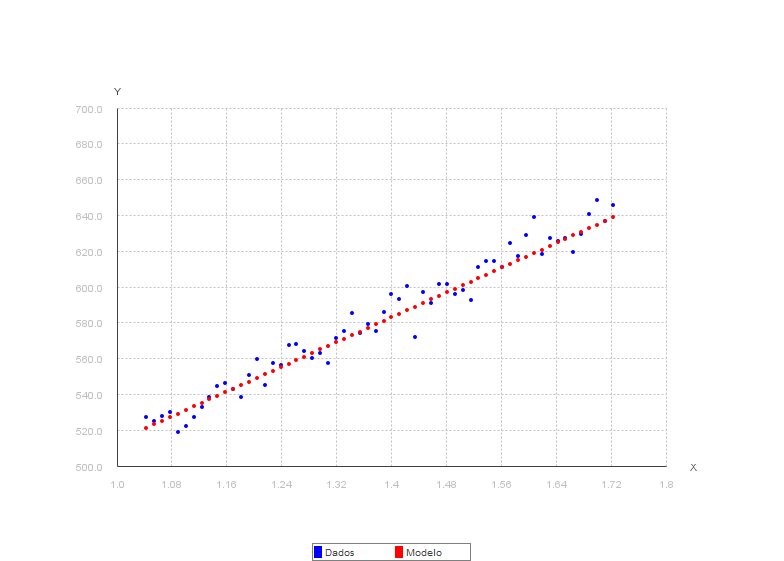
                    <figcaption>Linear Regression</figcaption>
                </figure>
            </td>
        </tr>
    </table>
    
- Code example for training a neural network with the library:
    ```java
    DataLoader dataLoader = new DataLoader(root + "/npy/train/x_train250.npy", root + "/npy/train/y_train250.npy", root + "/npy/test/x_test250.npy", root + "/npy/test/y_test250.npy");
    INDArray xTrain = dataLoader.getAllTrainImages().get(NDArrayIndex.interval(0, trainSize));
    INDArray yTrain = dataLoader.getAllTrainLabels().reshape(-1, 1).get(NDArrayIndex.interval(0, trainSize));
    INDArray xTest = dataLoader.getAllTestImages().get(NDArrayIndex.interval(0, testSize));
    INDArray yTest = dataLoader.getAllTestLabels().reshape(-1, 1).get(NDArrayIndex.interval(0, testSize));

    // Normalization
    xTrain = xTrain.divi(255);
    xTest = xTest.divi(255);
    // Reshape
    xTrain = xTrain.reshape(xTrain.rows(), 28, 28, 1);
    xTest = xTest.reshape(xTest.rows(), 28, 28, 1);
  
    NeuralNetwork model = new ModelBuilder()
        .add(new Conv2D(32, 2, Arrays.asList(2, 2), "valid", Activation.create("relu"), "he"))
        .add(new Conv2D(16, 1, Arrays.asList(1, 1), "valid", Activation.create("relu"), "he"))
        .add(new Flatten())
        .add(new Dense(178, Activation.create("relu"), "he"))
        .add(new Dropout(0.4))
        .add(new Dense(49, Activation.create("relu"), "he"))
        .add(new Dropout(0.3))
        .add(new Dense(numClasses,  Activation.create("linear"), "he"))
        .build();
  
    int epochs = 20;
    int batchSize = 64;

    LearningRateDecayStrategy lr = new ExponentialDecayStrategy(0.01, 0.0001, epochs);
    Optimizer optimizer = new RMSProp(lr);
    Trainer trainer = new TrainerBuilder(model, xTrain, yTrain, xTest, yTest, new SoftmaxCrossEntropy())
            .setOptimizer(optimizer)
            .setBatchSize(batchSize)
            .setEpochs(epochs)
            .setEvalEvery(2)
            .setEarlyStopping(true)
            .setPatience(4)
            .setMetric(new Accuracy())
            .build();
    trainer.fit();
    ```
    Complete example: [QuickDrawNN.java](src/main/java/br/cafedl/neuralnetwork/examples/classification/image/qdraw/QuickDrawNN.java)

### Features

The library has the following features and is structured into the following packages:
```markdown
src/main/java/br/cafedl/neuralnetwork
├── core
│   ├── activation
│   ├── layers
│   ├── losses
│   ├── metrics
│   ├── optimizers
│   ├── models
│   └── train
└── data
│   └── preprocessing
└── database
└── examples
│   ├── activations
│   ├── classification
│   ├── regression
    └── persist
```

- Layers: [Dense](src/main/java/br/cafedl/neuralnetwork/core/layers/Dense.java), [Dropout](src/main/java/br/cafedl/neuralnetwork/core/layers/Dropout.java), [Flatten](src/main/java/br/cafedl/neuralnetwork/core/layers/Flatten.java), [Conv2D](src/main/java/br/cafedl/neuralnetwork/core/layers/Conv2D.java), [MaxPooling2D](src/main/java/br/cafedl/neuralnetwork/core/layers/MaxPooling2D.java), [ZeroPadding2D](src/main/java/br/cafedl/neuralnetwork/core/layers/ZeroPadding2D.java)
    - UML:
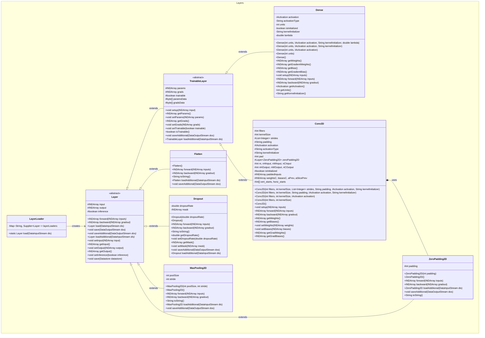
       
        
- Activation functions: [ReLU](src/main/java/br/cafedl/neuralnetwork/core/activation/ReLU.java), [LeakyReLU](src/main/java/br/cafedl/neuralnetwork/core/activation/LeakyReLU.java), [SiLU](src/main/java/br/cafedl/neuralnetwork/core/activation/SiLU.java), [Sigmoid](src/main/java/br/cafedl/neuralnetwork/core/activation/Sigmoid.java), [Tanh](src/main/java/br/cafedl/neuralnetwork/core/activation/TanH.java), [Softmax](src/main/java/br/cafedl/neuralnetwork/core/activation/Softmax.java)
    - [Ilustração](src/main/java/br/cafedl/neuralnetwork/examples/activations/PlotGraphs.java):
        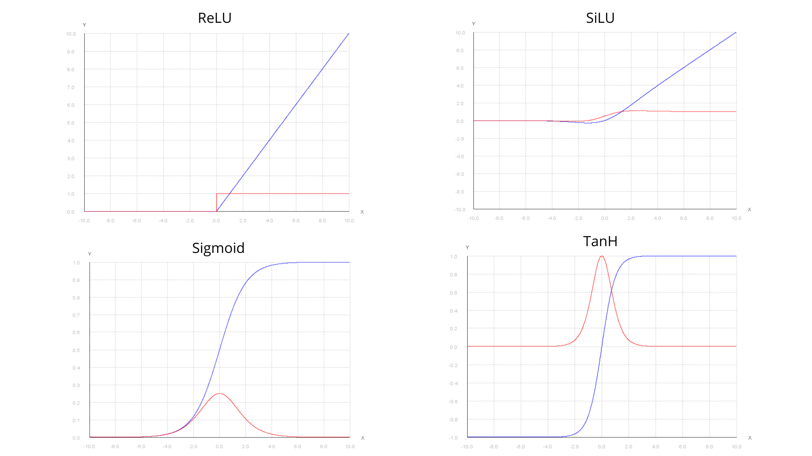
  
    - UML:
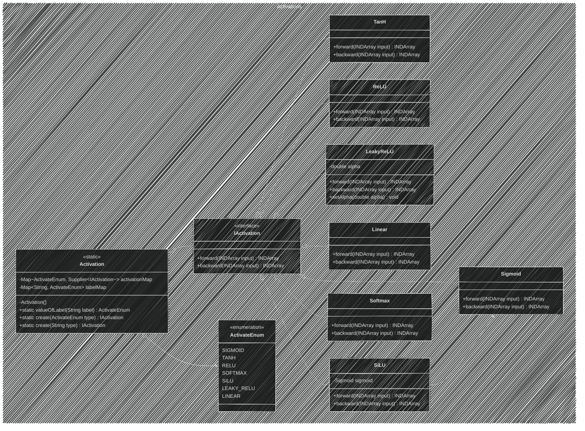


- Loss Functions: [MSE](src/main/java/br/cafedl/neuralnetwork/core/losses/MeanSquaredError.java), [BinaryCrossEntropy](src/main/java/br/cafedl/neuralnetwork/core/losses/BinaryCrossEntropy.java), [CategoricalCrossEntropy](src/main/java/br/cafedl/neuralnetwork/core/losses/CategoricalCrossEntropy.java), [SoftmaxCrossEntropy](src/main/java/br/cafedl/neuralnetwork/core/losses/SoftmaxCrossEntropy.java)

    - UML:
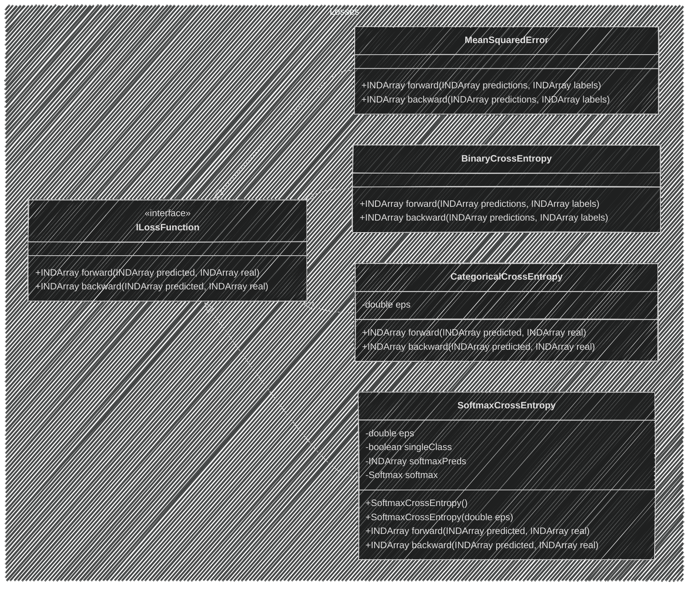
    

- Optimizers: [SGD](src/main/java/br/cafedl/neuralnetwork/core/optimizers/SGD.java), [Adam](src/main/java/br/cafedl/neuralnetwork/core/optimizers/Adam.java), [RMSProp](src/main/java/br/cafedl/neuralnetwork/core/optimizers/RMSProp.java), [AdaGrad](src/main/java/br/cafedl/neuralnetwork/core/optimizers/AdaGrad.java), [AdaDelta](src/main/java/br/cafedl/neuralnetwork/core/optimizers/AdaDelta.java), [SGDMomentum](src/main/java/br/cafedl/neuralnetwork/core/optimizers/SGDMomentum.java), [SGDNesterov](src/main/java/br/cafedl/neuralnetwork/core/optimizers/SGDNesterov.java), [RegularizedSGD](src/main/java/br/cafedl/neuralnetwork/core/optimizers/RegularizedSGD.java)
    - Learning Rate Decay: [ExponentialDecay](src/main/java/br/cafedl/neuralnetwork/core/optimizers/ExponentialDecayStrategy.java), [LinearDecay](src/main/java/br/cafedl/neuralnetwork/core/optimizers/LinearDecayStrategy.java)
      
    - UML:
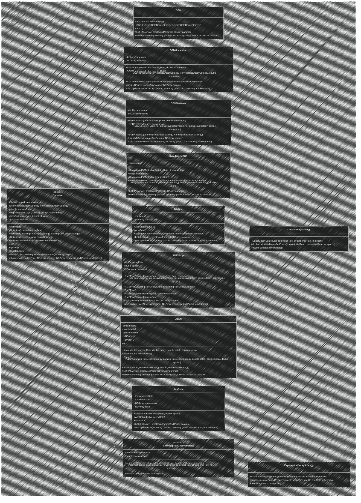


- Models: [ModelBuilder](src/main/java/br/cafedl/neuralnetwork/core/models/ModelBuilder.java), [NeuralNetwork](src/main/java/br/cafedl/neuralnetwork/core/models/NeuralNetwork.java)
    - UML:
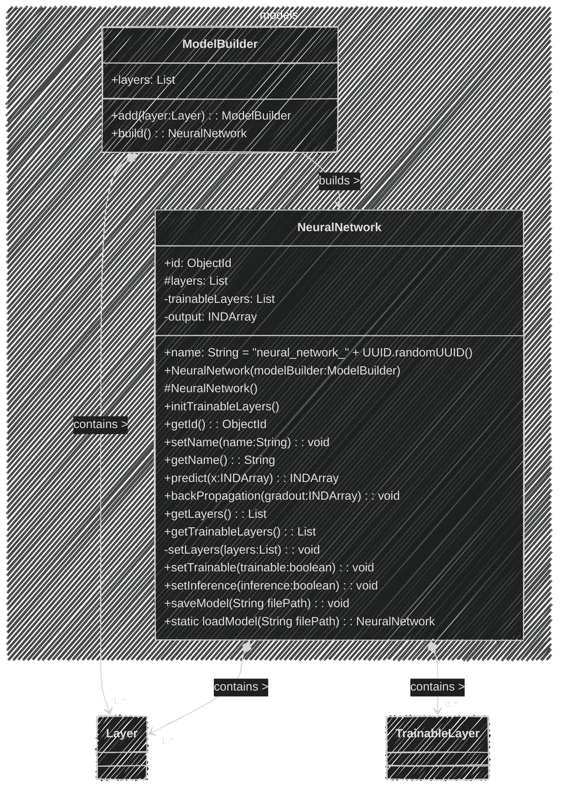
        

- Train: [Trainer](src/main/java/br/cafedl/neuralnetwork/core/train/Trainer.java), [TrainerBuilder](src/main/java/br/cafedl/neuralnetwork/core/train/TrainerBuilder.java)
    - UML:
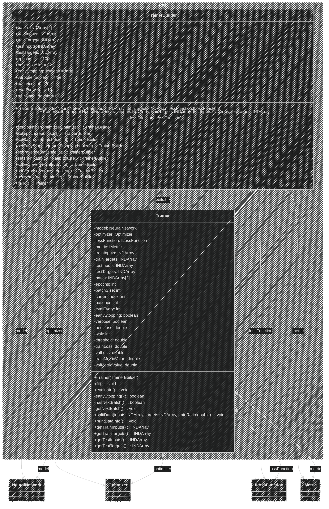
    

- Metrics: [Accuracy](src/main/java/br/cafedl/neuralnetwork/core/metrics/Accuracy.java), [Precision](src/main/java/br/cafedl/neuralnetwork/core/metrics/Precision.java), [Recall](src/main/java/br/cafedl/neuralnetwork/core/metrics/Recall.java), [F1Score](src/main/java/br/cafedl/neuralnetwork/core/metrics/F1Score.java), [MSE](src/main/java/br/cafedl/neuralnetwork/core/metrics/MSE.java), [MAE](src/main/java/br/cafedl/neuralnetwork/core/metrics/MAE.java), [RMSE](src/main/java/br/cafedl/neuralnetwork/core/metrics/RMSE.java), [R2](src/main/java/br/cafedl/neuralnetwork/core/metrics/R2.java)
    - UML:
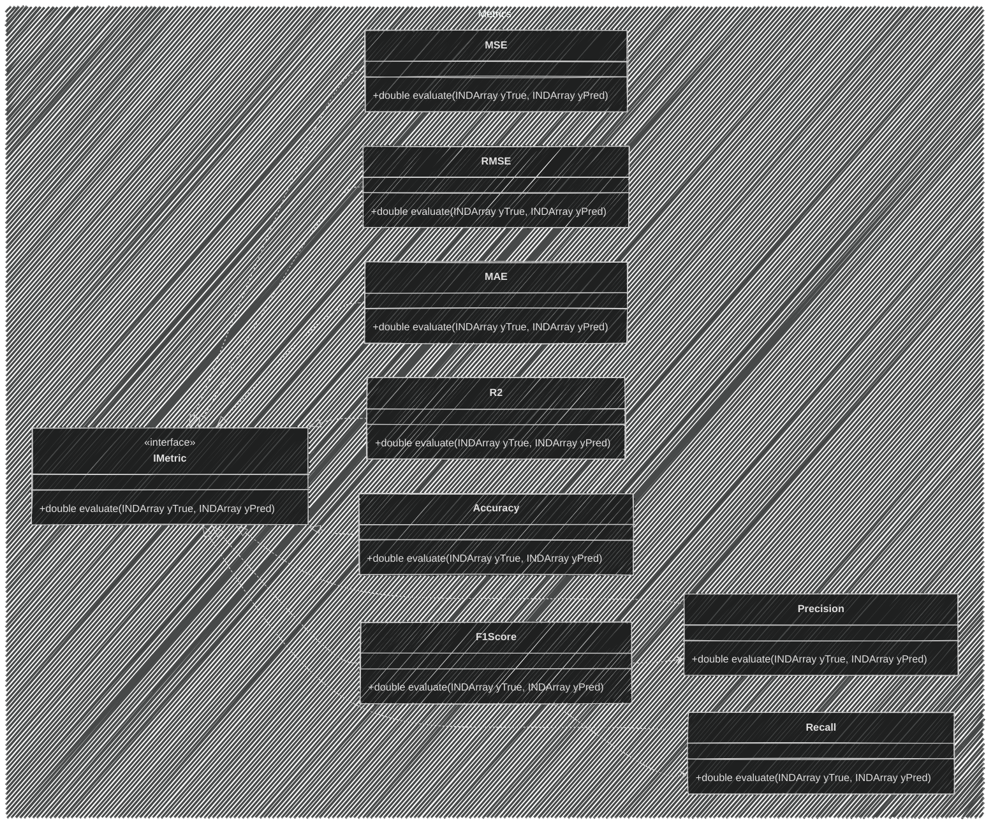

- Data: [DataProcessor](src/main/java/br/cafedl/neuralnetwork/data/processing/DataProcessor.java), [DataPipeline](src/main/java/br/cafedl/neuralnetwork/data/processing/DataPipeline.java), [StandardScaler](src/main/java/br/cafedl/neuralnetwork/data/processing/StandardScaler.java), [MinMaxScaler](src/main/java/br/cafedl/neuralnetwork/data/processing/MinMaxScaler.java), [Util](src/main/java/br/cafedl/neuralnetwork/data/Util.java), [DataLoader](src/main/java/br/cafedl/neuralnetwork/data/DataLoader.java), [PlotDataPredict](src/main/java/br/cafedl/neuralnetwork/data/PlotDataPredict.java)
    - UML:
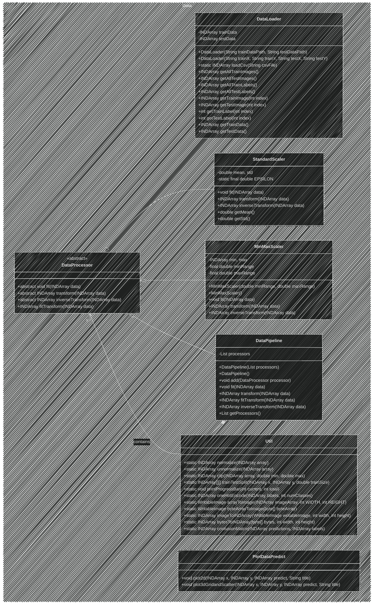

- Database: [NeuralNetworkService](src/main/java/br/cafedl/neuralnetwork/database/NeuralNetworkService.java), [NeuralNetworkRepository](src/main/java/br/cafedl/neuralnetwork/database/NeuralNetworkRepository.java), [NeuralNetworkEntity](src/main/java/br/cafedl/neuralnetwork/database/NeuralNetworkEntity.java)
    - UML:
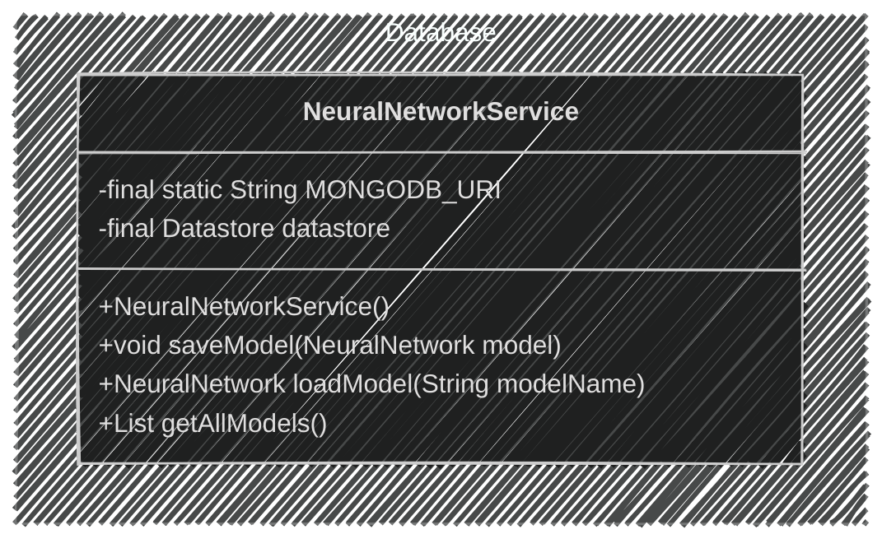

Full diagram: 

```mermaid
---
config:
  look: handDrawn
  theme: dark
---
classDiagram
    namespace Activations {
        class IActivation {
            <<interface>>
            +forward(INDArray input) INDArray
            +backward(INDArray input) INDArray
        }
        class Activation {
            <<static>>
            -Map~ActivateEnum, Supplier~IActivation~~ activationMap
            -Map~String, ActivateEnum~ labelMap
            -Activation() 
            +static valueOfLabel(String label) ActivateEnum
            +static create(ActivateEnum type) IActivation
            +static create(String type) IActivation
        }
        class ActivateEnum {
            <<enumeration>>
            SIGMOID
            TANH
            RELU
            SOFTMAX
            SILU
            LEAKY_RELU
            LINEAR
        }
        class Sigmoid {
            +forward(INDArray input) INDArray
            +backward(INDArray input) INDArray
        }
        class TanH {
            +forward(INDArray input) INDArray
            +backward(INDArray input) INDArray
        }
        class ReLU {
            +forward(INDArray input) INDArray
            +backward(INDArray input) INDArray
        }
        class LeakyReLU {
            -double alpha
            +forward(INDArray input) INDArray
            +backward(INDArray input) INDArray
            +setAlpha(double alpha) void
        }
        class Linear {
            +forward(INDArray input) INDArray
            +backward(INDArray input) INDArray
        }
        class SiLU {
            -Sigmoid sigmoid
            +forward(INDArray input) INDArray
            +backward(INDArray input) INDArray
        }
        class Softmax {
            +forward(INDArray input) INDArray
            +backward(INDArray input) INDArray
        }
    }

    IActivation <|.. Sigmoid
    IActivation <|.. TanH
    IActivation <|.. ReLU
    IActivation <|.. LeakyReLU
    IActivation <|.. Linear
    IActivation <|.. SiLU
    IActivation <|.. Softmax
    Activation o--> ActivateEnum
    Activation <|.. IActivation
    SiLU ..> Sigmoid

    Dense *--> IActivation
    Conv2D *--> IActivation
    
    namespace models {
        class ModelBuilder {
            +layers: List<Layer>
            +add(layer:Layer): ModelBuilder
            +build(): NeuralNetwork
        }
        class NeuralNetwork {
            +id: ObjectId
            +name: String = "neural_network_" + UUID.randomUUID()
            #layers: List<Layer>
            -trainableLayers: List<TrainableLayer>
            -output: INDArray
            +NeuralNetwork(modelBuilder:ModelBuilder)
            #NeuralNetwork()
            +initTrainableLayers()
            +getId(): ObjectId
            +setName(name:String): void
            +getName(): String
            +predict(x:INDArray): INDArray
            +backPropagation(gradout:INDArray): void
            +getLayers(): List<Layer>
            +getTrainableLayers(): List<TrainableLayer>
            -setLayers(layers:List<Layer>): void
            +setTrainable(trainable:boolean): void
            +setInference(inference:boolean): void
            +saveModel(String filePath): void
            +static loadModel(String filePath): NeuralNetwork
        }
    }
    
    %% Relationships for models namespace
    ModelBuilder --> NeuralNetwork: builds >
    ModelBuilder *--> "1..*" Layer: contains >
    NeuralNetwork *--> "1..*" Layer: contains >
    NeuralNetwork *--> "0..*" TrainableLayer: contains >
    Optimizer o--> NeuralNetwork: manages >
    NeuralNetwork ..> LayerLoader: uses >
    
    namespace Layers {
        class Layer {
            <<abstract>>
            #INDArray input
            #INDArray output
            #boolean inference
            +INDArray forward(INDArray inputs)* 
            +INDArray backward(INDArray gradout)* 
            +Layer load(DataInputStream dis)
            +void save(DataOutputStream dos)
            +void saveAdditional(DataOutputStream dos)*
            +Layer loadAdditional(DataInputStream dis)*
            +void setInput(INDArray input)
            +INDArray getInput()
            +void setOutput(INDArray output)
            +INDArray getOutput()
            +void setInference(boolean inference)
            +void save(Datastore datastore)
        }
        class Flatten {
            +Flatten()
            +INDArray forward(INDArray inputs)
            +INDArray backward(INDArray gradout)
            +String toString()
            +Flatten loadAdditional(DataInputStream dis)
            +void saveAdditional(DataOutputStream dos)
        }
        class Dropout {
            -double dropoutRate
            -INDArray mask
            +Dropout(double dropoutRate)
            +Dropout()
            +INDArray forward(INDArray inputs)
            +INDArray backward(INDArray gradout)
            +String toString()
            +double getDropoutRate()
            +void setDropoutRate(double dropoutRate)
            +INDArray getMask()
            +void setMask(INDArray mask)
            +void saveAdditional(DataOutputStream dos)
            +Dropout loadAdditional(DataInputStream dis)
        }
        class ZeroPadding2D {
            #int padding
            +ZeroPadding2D(int padding)
            +ZeroPadding2D()
            +INDArray forward(INDArray inputs)
            +INDArray backward(INDArray gradout)
            +ZeroPadding2D loadAdditional(DataInputStream dis) 
            +void saveAdditional(DataOutputStream dos)
            +String toString()
        }
        class MaxPooling2D {
            -int poolSize
            -int stride
            +MaxPooling2D(int poolSize, int stride)
            +MaxPooling2D()
            +INDArray forward(INDArray inputs)
            +INDArray backward(INDArray gradout)
            +String toString()
            +MaxPooling2D loadAdditional(DataInputStream dis)
            +void saveAdditional(DataOutputStream dos)
        }
        class TrainableLayer {
            <<abstract>>
            #INDArray params
            #INDArray grads
            #boolean trainable
            #byte[] paramsData
            #byte[] gradsData
            +void setup(INDArray input)
            +INDArray getParams()
            +void setParams(INDArray params)
            +INDArray getGrads()
            +void setGrads(INDArray grads)
            +void setTrainable(boolean trainable)
            +boolean isTrainable()
            +void saveAdditional(DataOutputStream dos)
            +TrainableLayer loadAdditional(DataInputStream dis)
        }
        class Dense {
            -IActivation activation
            -String activationType
            -int units
            -boolean isInitialized
            -String kernelInitializer
            -double lambda
            +Dense(int units, IActivation activation, String kernelInitializer, double lambda)
            +Dense(int units, IActivation activation, String kernelInitializer)
            +Dense(int units, IActivation activation)
            +Dense(int units)
            +Dense()
            +INDArray getWeights()
            +INDArray getGradientWeights()
            +INDArray getBias()
            +INDArray getGradientBias()
            +void setup(INDArray inputs)
            +INDArray forward(INDArray inputs)
            +INDArray backward(INDArray gradout)
            +IActivation getActivation()
            +int getUnits()
            +String getKernelInitializer()
        }
        class Conv2D {
            #int filters
            #int kernelSize
            #List~Integer~ strides
            #String padding
            #IActivation activation
            #String activationType
            #String kernelInitializer
            #int pad
            #Layer~ZeroPadding2D~ zeroPadding2D
            #int m, nHInput, nWInput, nCInput
            #int nHOutput, nWOutput, nCOutput
            #boolean isInitialized
            #INDArray paddedInputs
            #INDArray weightsC, biasesC, aPrev, aSlicePrev
            #int[] vert_starts, horiz_starts
            +Conv2D(int filters, int kernelSize, List~Integer~ strides, String padding, IActivation activation, String kernelInitializer)
            +Conv2D(int filters, int kernelSize, String padding, IActivation activation, String kernelInitializer)
            +Conv2D(int filters, int kernelSize, IActivation activation)
            +Conv2D(int filters, int kernelSize)
            +Conv2D()
            +void setup(INDArray inputs)
            +INDArray forward(INDArray inputs)
            +INDArray backward(INDArray gradout)
            +INDArray getWeights()
            +INDArray getBiases()
            +void setWeights(INDArray weights)
            +void setBiases(INDArray biases)
            +INDArray getGradWeights()
            +INDArray getGradBiases()
        }
        class LayerLoader {
            -Map~String, Supplier~Layer~~ layerLoaders
            +static Layer load(DataInputStream dis)
        }
    }
    Layer <|-- TrainableLayer : >bind< T<-TrainableLayer
    TrainableLayer <|-- Dense : extends
    TrainableLayer <|-- Conv2D : extends
    Layer <|-- Flatten : >bind< T<-Flatten
    Layer <|-- Dropout : >bind< T<-Dropout
    Layer <|-- MaxPooling2D : >bind< T<-MaxPooling2D
    Layer <|-- ZeroPadding2D : >bind< T<-ZeroPadding2D
    Conv2D *-- ZeroPadding2D : uses
    LayerLoader --> Layer : creates

    namespace Optimizers {
        class Optimizer {
            <<abstract>>
            #NeuralNetwork neuralNetwork
            #LearningRateDecayStrategy learningRateDecayStrategy
            #double learningRate
            #Map~TrainableLayer, List~INDArray~~ auxParams
            #List~TrainableLayer~ trainableLayers
            -boolean initialized
            
            +Optimizer()
            #Optimizer(double learningRate)
            +Optimizer(LearningRateDecayStrategy learningRateDecayStrategy)
            +Optimizer(NeuralNetwork neuralNetwork)
            +setNeuralNetwork(NeuralNetwork neuralNetwork)
            #init()
            +update()
            +updateEpoch()
            #abstract List~INDArray~ createAuxParams(INDArray params)
            #abstract void updateRule(INDArray params, INDArray grads, List~INDArray~ auxParams)
        }
        
        %% Learning Rate Decay Strategies
        class LearningRateDecayStrategy {
            <<abstract>>
            #double decayPerEpoch
            #double learningRate
            
            +LearningRateDecayStrategy(double initialRate, double finalRate, int epochs)
            #abstract double calculateDecayPerEpoch(double initialRate, double finalRate, int epochs)
            +abstract double updateLearningRate()
        }
        

        class ExponentialDecayStrategy {
            +ExponentialDecayStrategy(double initialRate, double finalRate, int epochs)
            #double calculateDecayPerEpoch(double initialRate, double finalRate, int epochs)
            +double updateLearningRate()
        }

        class LinearDecayStrategy {
            +LinearDecayStrategy(double initialRate, double finalRate, int epochs)
            #double calculateDecayPerEpoch(double initialRate, double finalRate, int epochs)
            +double updateLearningRate()
        }
        
        %% SGD Optimizers
        class SGD {
            +SGD(double learningRate)
            +SGD(LearningRateDecayStrategy learningRateDecayStrategy)
            +SGD()
            #List~INDArray~ createAuxParams(INDArray params)
            #void updateRule(INDArray params, INDArray grads, List~INDArray~ auxParams)
        }
        
        class SGDMomentum {
            -double momentum
            -INDArray velocities
            
            +SGDMomentum(double learningRate, double momentum)
            +SGDMomentum(double learningRate)
            +SGDMomentum(LearningRateDecayStrategy learningRateDecayStrategy, double momentum)
            +SGDMomentum(LearningRateDecayStrategy learningRateDecayStrategy)
            #List~INDArray~ createAuxParams(INDArray params)
            #void updateRule(INDArray params, INDArray grads, List~INDArray~ auxParams)
        }
        
        class SGDNesterov {
            -double momentum
            -INDArray velocities
            
            +SGDNesterov(double learningRate, double momentum)
            +SGDNesterov(double learningRate)
            +SGDNesterov(LearningRateDecayStrategy learningRateDecayStrategy, double momentum)
            +SGDNesterov(LearningRateDecayStrategy learningRateDecayStrategy)
            #List~INDArray~ createAuxParams(INDArray params)
            #void updateRule(INDArray params, INDArray grads, List~INDArray~ auxParams)
        }
        
        class RegularizedSGD {
            -double alpha
            
            +RegularizedSGD(double learningRate, double alpha)
            +RegularizedSGD()
            +RegularizedSGD(double learningRate)
            +RegularizedSGD(LearningRateDecayStrategy learningRateDecayStrategy)
            +RegularizedSGD(LearningRateDecayStrategy learningRateDecayStrategy, double alpha)
            #List~INDArray~ createAuxParams(INDArray params)
            #void updateRule(INDArray params, INDArray grads, List~INDArray~ auxParams)
        }
        
        %% Adaptive optimizers
        class AdaGrad {
            -double eps
            -INDArray sumSquares
            
            +AdaGrad(double lr)
            +AdaGrad()
            +AdaGrad(LearningRateDecayStrategy learningRateDecayStrategy)
            #List~INDArray~ createAuxParams(INDArray params)
            #void updateRule(INDArray params, INDArray grads, List~INDArray~ auxParams)
        }
        
        class RMSProp {
            -double decayRate
            -double epsilon
            -INDArray accumulator
            
            +RMSProp(double learningRate, double decayRate, double epsilon)
            +RMSProp(LearningRateDecayStrategy learningRateDecayStrategy, double decayRate, double epsilon)
            +RMSProp(LearningRateDecayStrategy learningRateDecayStrategy)
            +RMSProp()
            +RMSProp(double learningRate, double decayRate)
            +RMSProp(double learningRate)
            #List~INDArray~ createAuxParams(INDArray params)
            #void updateRule(INDArray params, INDArray grads, List~INDArray~ auxParams)
        }
        
        class Adam {
            -double beta1
            -double beta2
            -double epsilon
            -INDArray m
            -INDArray v
            -int t
            
            +Adam(double learningRate, double beta1, double beta2, double epsilon)
            +Adam(double learningRate)
            +Adam()
            +Adam(LearningRateDecayStrategy learningRateDecayStrategy, double beta1, double beta2, double epsilon)
            +Adam(LearningRateDecayStrategy learningRateDecayStrategy)
            #List~INDArray~ createAuxParams(INDArray params)
            #void updateRule(INDArray params, INDArray grads, List~INDArray~ auxParams)
        }
        
        class AdaDelta {
            -double decayRate
            -double epsilon
            -INDArray accumulator
            -INDArray delta
            
            +AdaDelta(double decayRate, double epsilon)
            +AdaDelta(double decayRate)
            +AdaDelta()
            #List~INDArray~ createAuxParams(INDArray params)
            #void updateRule(INDArray params, INDArray grads, List~INDArray~ auxParams)
        }

    }

    Optimizer <|-- SGD
    Optimizer <|-- SGDMomentum
    Optimizer <|-- SGDNesterov
    Optimizer <|-- RegularizedSGD
    Optimizer <|-- AdaGrad
    Optimizer <|-- RMSProp
    Optimizer <|-- Adam
    Optimizer <|-- AdaDelta
    
    LearningRateDecayStrategy <|-- LinearDecayStrategy
    LearningRateDecayStrategy <|-- ExponentialDecayStrategy
    
    Optimizer o-- LearningRateDecayStrategy

    TrainableLayer <--o Optimizer: trainableLayers *

    namespace Losses {
        class ILossFunction {
            <<interface>>
            +INDArray forward(INDArray predicted, INDArray real)
            +INDArray backward(INDArray predicted, INDArray real)
        }

        %% Concrete classes implementing ILossFunction
        class MeanSquaredError {
            +INDArray forward(INDArray predictions, INDArray labels)
            +INDArray backward(INDArray predictions, INDArray labels)
        }

        class BinaryCrossEntropy {
            +INDArray forward(INDArray predictions, INDArray labels)
            +INDArray backward(INDArray predictions, INDArray labels)
        }

        class CategoricalCrossEntropy {
            -double eps
            +INDArray forward(INDArray predicted, INDArray real)
            +INDArray backward(INDArray predicted, INDArray real)
        }

        class SoftmaxCrossEntropy {
            -double eps
            -boolean singleClass
            -INDArray softmaxPreds
            -Softmax softmax
            +SoftmaxCrossEntropy()
            +SoftmaxCrossEntropy(double eps)
            +INDArray forward(INDArray predicted, INDArray real)
            +INDArray backward(INDArray predicted, INDArray real)
        }
    }

    ILossFunction <|.. MeanSquaredError
    ILossFunction <|.. BinaryCrossEntropy
    ILossFunction <|.. CategoricalCrossEntropy
    ILossFunction <|.. SoftmaxCrossEntropy

    namespace Metrics {
        class IMetric {
            <<interface>>
            +double evaluate(INDArray yTrue, INDArray yPred)
        }
        
        class MSE {
            +double evaluate(INDArray yTrue, INDArray yPred)
        }
        
        class RMSE {
            +double evaluate(INDArray yTrue, INDArray yPred)
        }
        
        class MAE {
            +double evaluate(INDArray yTrue, INDArray yPred)
        }
        
        class R2 {
            +double evaluate(INDArray yTrue, INDArray yPred)
        }
        
        class Accuracy {
            +double evaluate(INDArray yTrue, INDArray yPred)
        }

        class Precision {
            +double evaluate(INDArray yTrue, INDArray yPred)
        }
        
        class Recall {
            +double evaluate(INDArray yTrue, INDArray yPred)
        }
        
        class F1Score {
            +double evaluate(INDArray yTrue, INDArray yPred)
        }

    }

    IMetric <|.. MSE
    IMetric <|.. RMSE
    IMetric <|.. MAE
    IMetric <|.. R2 
    IMetric <|.. Accuracy 
    IMetric <|.. Precision 
    IMetric <|.. Recall 
    IMetric <|.. F1Score

    F1Score ..> Precision 
    F1Score ..> Recall 
    
    namespace Train {
        class TrainerBuilder {
            +batch: INDArray[2]
            +trainInputs: INDArray
            +trainTargets: INDArray
            +testInputs: INDArray
            +testTargets: INDArray
            +epochs: int = 100
            +batchSize: int = 32
            +earlyStopping: boolean = false
            +verbose: boolean = true
            +patience: int = 20
            +evalEvery: int = 10
            +trainRatio: double = 0.8
            
            +TrainerBuilder(model:NeuralNetwork, trainInputs:INDArray, trainTargets:INDArray, lossFunction:ILossFunction)
            +TrainerBuilder(model:NeuralNetwork, trainInputs:INDArray, trainTargets:INDArray, testInputs:INDArray, testTargets:INDArray, lossFunction:ILossFunction)
            +setOptimizer(optimizer:Optimizer): TrainerBuilder
            +setEpochs(epochs:int): TrainerBuilder
            +setBatchSize(batchSize:int): TrainerBuilder
            +setEarlyStopping(earlyStopping:boolean): TrainerBuilder
            +setPatience(patience:int): TrainerBuilder
            +setTrainRatio(trainRatio:double): TrainerBuilder
            +setEvalEvery(evalEvery:int): TrainerBuilder
            +setVerbose(verbose:boolean): TrainerBuilder
            +setMetric(metric:IMetric): TrainerBuilder
            +build(): Trainer
        }
        
        class Trainer {
            -model: NeuralNetwork
            -optimizer: Optimizer
            -lossFunction: ILossFunction
            -metric: IMetric
            -trainInputs: INDArray
            -trainTargets: INDArray
            -testInputs: INDArray
            -testTargets: INDArray
            -batch: INDArray[2]
            -epochs: int
            -batchSize: int
            -currentIndex: int
            -patience: int
            -evalEvery: int
            -earlyStopping: boolean
            -verbose: boolean
            -bestLoss: double
            -wait: int
            -threshold: double
            -trainLoss: double
            -valLoss: double
            -trainMetricValue: double
            -valMetricValue: double
            
            +Trainer(TrainerBuilder)
            +fit(): void
            +evaluate(): void
            -earlyStopping(): boolean
            -hasNextBatch(): boolean
            -getNextBatch(): void
            +splitData(inputs:INDArray, targets:INDArray, trainRatio:double): void
            +printDataInfo(): void
            +getTrainInputs(): INDArray
            +getTrainTargets(): INDArray
            +getTestInputs(): INDArray
            +getTestTargets(): INDArray
        }
    }
    
    %% Relationships for Train namespace
    TrainerBuilder --> Trainer: builds >
    TrainerBuilder o--> NeuralNetwork: model
    TrainerBuilder o--> ILossFunction: lossFunction
    TrainerBuilder o--> IMetric: metric
    TrainerBuilder o--> Optimizer: optimizer
    
    Trainer *--> NeuralNetwork: model
    Trainer *--> Optimizer: optimizer
    Trainer *--> ILossFunction: lossFunction
    Trainer *--> IMetric: metric

    namespace Data {
        class DataLoader {
            -INDArray trainData
            -INDArray testData
            +DataLoader(String trainDataPath, String testDataPath)
            +DataLoader(String trainX, String trainY, String testX, String testY)
            +static INDArray loadCsv(String csvFile)
            +INDArray getAllTrainImages()
            +INDArray getAllTestImages()
            +INDArray getAllTrainLabels()
            +INDArray getAllTestLabels()
            +INDArray getTrainImage(int index)
            +INDArray getTestImage(int index)
            +int getTrainLabel(int index)
            +int getTestLabel(int index)
            +INDArray getTrainData()
            +INDArray getTestData()
        }

        class Util {
            +static INDArray normalize(INDArray array)
            +static INDArray unnormalize(INDArray array)
            +static INDArray clip(INDArray array, double min, double max)
            +static INDArray[][] trainTestSplit(INDArray x, INDArray y, double trainSize)
            +static void printProgressBar(int current, int total)
            +static INDArray oneHotEncode(INDArray labels, int numClasses)
            +static WritableImage arrayToImage(INDArray imageArray, int WIDTH, int HEIGHT)
            +static WritableImage byteArrayToImage(byte[] byteArray)
            +static INDArray imageToINDArray(WritableImage writableImage, int width, int height)
            +static INDArray bytesToINDArray(byte[] bytes, int width, int height)
            +static INDArray confusionMatrix(INDArray predictions, INDArray labels)
        }

        class PlotDataPredict {
            +void plot2d(INDArray x, INDArray y, INDArray predict, String title)
            +void plot3dGridandScatter(INDArray x, INDArray y, INDArray predict, String title)
        }

        class DataProcessor {
            <<abstract>>
            +abstract void fit(INDArray data)
            +abstract INDArray transform(INDArray data)
            +abstract INDArray inverseTransform(INDArray data)
            +INDArray fitTransform(INDArray data)
        }

        class DataPipeline {
            -List<DataProcessor> processors
            +DataPipeline(List<DataProcessor> processors)
            +DataPipeline()
            +void add(DataProcessor processor)
            +void fit(INDArray data)
            +INDArray transform(INDArray data)
            +INDArray fitTransform(INDArray data)
            +INDArray inverseTransform(INDArray data)
            +List<DataProcessor> getProcessors()
        }

        class StandardScaler {
            -double mean, std
            -static final double EPSILON
            +void fit(INDArray data)
            +INDArray transform(INDArray data)
            +INDArray inverseTransform(INDArray data)
            +double getMean()
            +double getStd()
        }

        class MinMaxScaler {
            -INDArray min, max
            -final double minRange
            -final double maxRange
            +MinMaxScaler(double minRange, double maxRange)
            +MinMaxScaler()
            +void fit(INDArray data)
            +INDArray transform(INDArray data)
            +INDArray inverseTransform(INDArray data)
        }
    }

    namespace Database {
        class NeuralNetworkService {
            -final static String MONGODB_URI
            -final Datastore datastore
            +NeuralNetworkService()
            +void saveModel(NeuralNetwork model)
            +NeuralNetwork loadModel(String modelName)
            +List<NeuralNetwork> getAllModels()
        }
    }

    %% Relationships within Data namespace
    DataProcessor <|-- StandardScaler
    DataProcessor <|-- MinMaxScaler
    DataProcessor <|-- DataPipeline
    DataPipeline *--> "0..*" DataProcessor: contains

    %% Relationships between Data and other namespaces
    Trainer ..> Util: uses
    Trainer ..> DataLoader: uses
    TrainerBuilder ..> DataLoader: uses
    
    NeuralNetwork ..> Util: uses
    TrainableLayer ..> Util: uses
    
    models.NeuralNetwork ..> Util: uses for data processing
    Trainer *--> DataLoader: loads data
    
    %% Relationships for Database namespace
    NeuralNetwork --o Database.NeuralNetworkService: manages
    Layer ..> Database.NeuralNetworkService: uses for persistence
    NeuralNetworkService ..> Datastore: uses
```

[UML Diagram (Dia)](src/main/resources/diagram/Diagram.dia)

--- 
## Game

The game essentially uses the model trained with the "library" in [QuickDrawNN](src/main/java/br/cafedl/neuralnetwork/examples/classification/image/qdraw/QuickDrawNN.java) to classify the drawings made by the player. Ten classes from the original dataset were selected, and each session consists of 4 rounds. In each round, if the prediction confidence is greater than 50%, the drawing and the round are saved in the database. There is also a visualization screen that allows users to view all the drawings saved in the database and delete them.

The game implementation uses JavaFX with the MVC pattern.

https://github.com/user-attachments/assets/2684f4ec-6d96-46ff-acc2-6fa272d6ab3f
