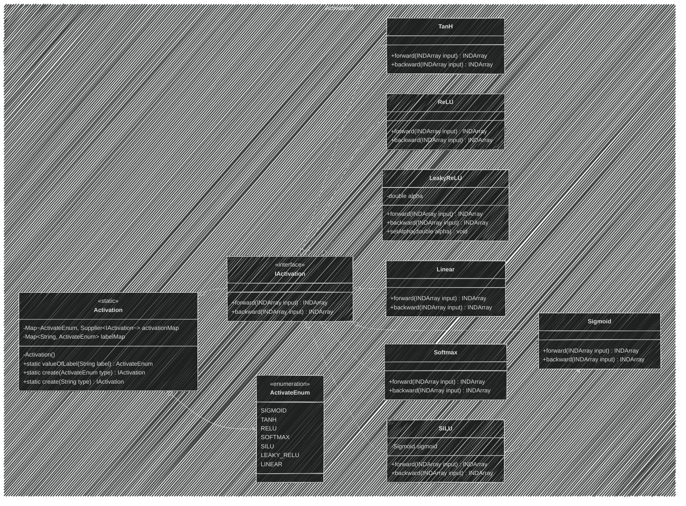

```mermaid
---
config:
  look: handDrawn
  theme: dark
---
classDiagram
    namespace Activations {
        class IActivation {
            <<interface>>
            +forward(INDArray input) INDArray
            +backward(INDArray input) INDArray
        }
        class Activation {
            <<static>>
            -Map~ActivateEnum, Supplier~IActivation~~ activationMap
            -Map~String, ActivateEnum~ labelMap
            -Activation() 
            +static valueOfLabel(String label) ActivateEnum
            +static create(ActivateEnum type) IActivation
            +static create(String type) IActivation
        }
        class ActivateEnum {
            <<enumeration>>
            SIGMOID
            TANH
            RELU
            SOFTMAX
            SILU
            LEAKY_RELU
            LINEAR
        }
        class Sigmoid {
            +forward(INDArray input) INDArray
            +backward(INDArray input) INDArray
        }
        class TanH {
            +forward(INDArray input) INDArray
            +backward(INDArray input) INDArray
        }
        class ReLU {
            +forward(INDArray input) INDArray
            +backward(INDArray input) INDArray
        }
        class LeakyReLU {
            -double alpha
            +forward(INDArray input) INDArray
            +backward(INDArray input) INDArray
            +setAlpha(double alpha) void
        }
        class Linear {
            +forward(INDArray input) INDArray
            +backward(INDArray input) INDArray
        }
        class SiLU {
            -Sigmoid sigmoid
            +forward(INDArray input) INDArray
            +backward(INDArray input) INDArray
        }
        class Softmax {
            +forward(INDArray input) INDArray
            +backward(INDArray input) INDArray
        }
    }

    IActivation <|.. Sigmoid
    IActivation <|.. TanH
    IActivation <|.. ReLU
    IActivation <|.. LeakyReLU
    IActivation <|.. Linear
    IActivation <|.. SiLU
    IActivation <|.. Softmax
    Activation o--> ActivateEnum
    Activation <|.. IActivation
    SiLU ..> Sigmoid
``` 