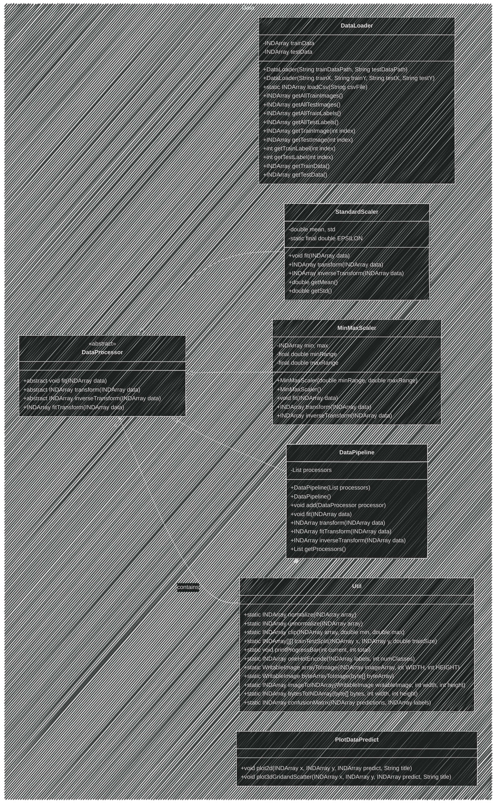

```mermaid
---
config:
  look: handDrawn
  theme: dark
---
classDiagram
    namespace Data {
        class DataLoader {
            -INDArray trainData
            -INDArray testData
            +DataLoader(String trainDataPath, String testDataPath)
            +DataLoader(String trainX, String trainY, String testX, String testY)
            +static INDArray loadCsv(String csvFile)
            +INDArray getAllTrainImages()
            +INDArray getAllTestImages()
            +INDArray getAllTrainLabels()
            +INDArray getAllTestLabels()
            +INDArray getTrainImage(int index)
            +INDArray getTestImage(int index)
            +int getTrainLabel(int index)
            +int getTestLabel(int index)
            +INDArray getTrainData()
            +INDArray getTestData()
        }

        class Util {
            +static INDArray normalize(INDArray array)
            +static INDArray unnormalize(INDArray array)
            +static INDArray clip(INDArray array, double min, double max)
            +static INDArray[][] trainTestSplit(INDArray x, INDArray y, double trainSize)
            +static void printProgressBar(int current, int total)
            +static INDArray oneHotEncode(INDArray labels, int numClasses)
            +static WritableImage arrayToImage(INDArray imageArray, int WIDTH, int HEIGHT)
            +static WritableImage byteArrayToImage(byte[] byteArray)
            +static INDArray imageToINDArray(WritableImage writableImage, int width, int height)
            +static INDArray bytesToINDArray(byte[] bytes, int width, int height)
            +static INDArray confusionMatrix(INDArray predictions, INDArray labels)
        }

        class PlotDataPredict {
            +void plot2d(INDArray x, INDArray y, INDArray predict, String title)
            +void plot3dGridandScatter(INDArray x, INDArray y, INDArray predict, String title)
        }

        class DataProcessor {
            <<abstract>>
            +abstract void fit(INDArray data)
            +abstract INDArray transform(INDArray data)
            +abstract INDArray inverseTransform(INDArray data)
            +INDArray fitTransform(INDArray data)
        }

        class DataPipeline {
            -List<DataProcessor> processors
            +DataPipeline(List<DataProcessor> processors)
            +DataPipeline()
            +void add(DataProcessor processor)
            +void fit(INDArray data)
            +INDArray transform(INDArray data)
            +INDArray fitTransform(INDArray data)
            +INDArray inverseTransform(INDArray data)
            +List<DataProcessor> getProcessors()
        }

        class StandardScaler {
            -double mean, std
            -static final double EPSILON
            +void fit(INDArray data)
            +INDArray transform(INDArray data)
            +INDArray inverseTransform(INDArray data)
            +double getMean()
            +double getStd()
        }

        class MinMaxScaler {
            -INDArray min, max
            -final double minRange
            -final double maxRange
            +MinMaxScaler(double minRange, double maxRange)
            +MinMaxScaler()
            +void fit(INDArray data)
            +INDArray transform(INDArray data)
            +INDArray inverseTransform(INDArray data)
        }
    }

    %% Relationships within Data namespace
    DataProcessor <|-- StandardScaler
    DataProcessor <|-- MinMaxScaler
    DataProcessor <|-- DataPipeline
    DataPipeline *--> "0..*" DataProcessor: contains
``` 