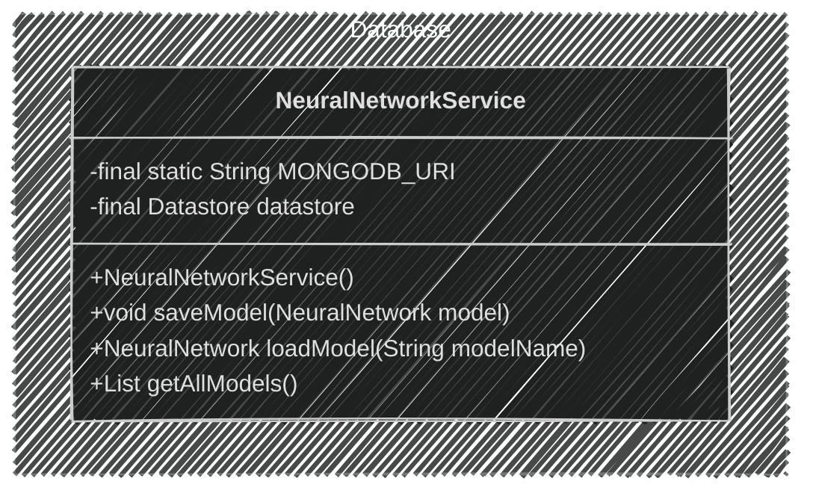

```mermaid
---
config:
  look: handDrawn
  theme: dark
---
classDiagram
    namespace Database {
        class NeuralNetworkService {
            -final static String MONGODB_URI
            -final Datastore datastore
            +NeuralNetworkService()
            +void saveModel(NeuralNetwork model)
            +NeuralNetwork loadModel(String modelName)
            +List<NeuralNetwork> getAllModels()
        }
    }
``` 