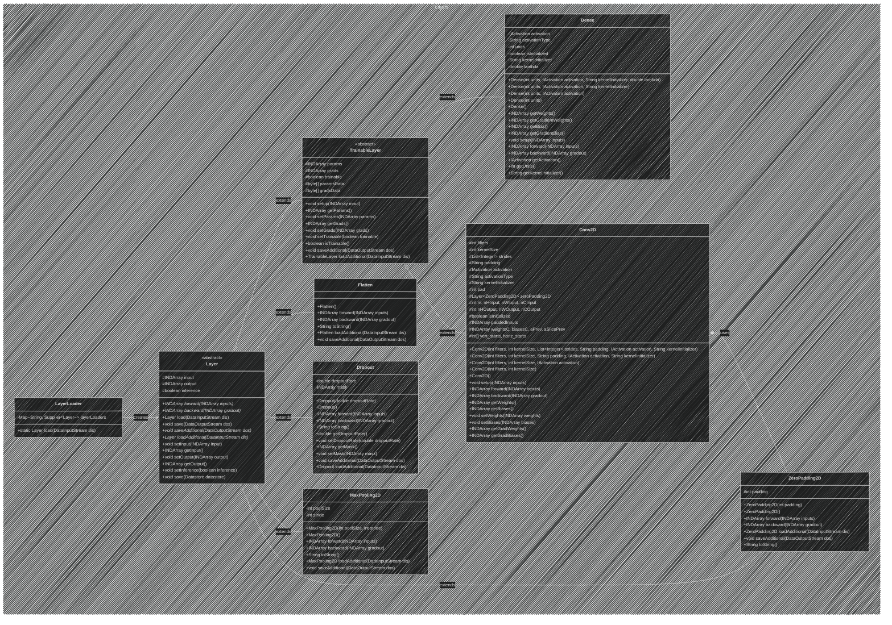

```mermaid
---
config:
  look: handDrawn
  theme: dark
---
classDiagram
    namespace Layers {
        class Layer {
            <<abstract>>
            #INDArray input
            #INDArray output
            #boolean inference
            +INDArray forward(INDArray inputs)* 
            +INDArray backward(INDArray gradout)* 
            +Layer load(DataInputStream dis)
            +void save(DataOutputStream dos)
            +void saveAdditional(DataOutputStream dos)*
            +Layer loadAdditional(DataInputStream dis)*
            +void setInput(INDArray input)
            +INDArray getInput()
            +void setOutput(INDArray output)
            +INDArray getOutput()
            +void setInference(boolean inference)
            +void save(Datastore datastore)
        }
        class Flatten {
            +Flatten()
            +INDArray forward(INDArray inputs)
            +INDArray backward(INDArray gradout)
            +String toString()
            +Flatten loadAdditional(DataInputStream dis)
            +void saveAdditional(DataOutputStream dos)
        }
        class Dropout {
            -double dropoutRate
            -INDArray mask
            +Dropout(double dropoutRate)
            +Dropout()
            +INDArray forward(INDArray inputs)
            +INDArray backward(INDArray gradout)
            +String toString()
            +double getDropoutRate()
            +void setDropoutRate(double dropoutRate)
            +INDArray getMask()
            +void setMask(INDArray mask)
            +void saveAdditional(DataOutputStream dos)
            +Dropout loadAdditional(DataInputStream dis)
        }
        class ZeroPadding2D {
            #int padding
            +ZeroPadding2D(int padding)
            +ZeroPadding2D()
            +INDArray forward(INDArray inputs)
            +INDArray backward(INDArray gradout)
            +ZeroPadding2D loadAdditional(DataInputStream dis) 
            +void saveAdditional(DataOutputStream dos)
            +String toString()
        }
        class MaxPooling2D {
            -int poolSize
            -int stride
            +MaxPooling2D(int poolSize, int stride)
            +MaxPooling2D()
            +INDArray forward(INDArray inputs)
            +INDArray backward(INDArray gradout)
            +String toString()
            +MaxPooling2D loadAdditional(DataInputStream dis)
            +void saveAdditional(DataOutputStream dos)
        }
        class TrainableLayer {
            <<abstract>>
            #INDArray params
            #INDArray grads
            #boolean trainable
            #byte[] paramsData
            #byte[] gradsData
            +void setup(INDArray input)
            +INDArray getParams()
            +void setParams(INDArray params)
            +INDArray getGrads()
            +void setGrads(INDArray grads)
            +void setTrainable(boolean trainable)
            +boolean isTrainable()
            +void saveAdditional(DataOutputStream dos)
            +TrainableLayer loadAdditional(DataInputStream dis)
        }
        class Dense {
            -IActivation activation
            -String activationType
            -int units
            -boolean isInitialized
            -String kernelInitializer
            -double lambda
            +Dense(int units, IActivation activation, String kernelInitializer, double lambda)
            +Dense(int units, IActivation activation, String kernelInitializer)
            +Dense(int units, IActivation activation)
            +Dense(int units)
            +Dense()
            +INDArray getWeights()
            +INDArray getGradientWeights()
            +INDArray getBias()
            +INDArray getGradientBias()
            +void setup(INDArray inputs)
            +INDArray forward(INDArray inputs)
            +INDArray backward(INDArray gradout)
            +IActivation getActivation()
            +int getUnits()
            +String getKernelInitializer()
        }
        class Conv2D {
            #int filters
            #int kernelSize
            #List~Integer~ strides
            #String padding
            #IActivation activation
            #String activationType
            #String kernelInitializer
            #int pad
            #Layer~ZeroPadding2D~ zeroPadding2D
            #int m, nHInput, nWInput, nCInput
            #int nHOutput, nWOutput, nCOutput
            #boolean isInitialized
            #INDArray paddedInputs
            #INDArray weightsC, biasesC, aPrev, aSlicePrev
            #int[] vert_starts, horiz_starts
            +Conv2D(int filters, int kernelSize, List~Integer~ strides, String padding, IActivation activation, String kernelInitializer)
            +Conv2D(int filters, int kernelSize, String padding, IActivation activation, String kernelInitializer)
            +Conv2D(int filters, int kernelSize, IActivation activation)
            +Conv2D(int filters, int kernelSize)
            +Conv2D()
            +void setup(INDArray inputs)
            +INDArray forward(INDArray inputs)
            +INDArray backward(INDArray gradout)
            +INDArray getWeights()
            +INDArray getBiases()
            +void setWeights(INDArray weights)
            +void setBiases(INDArray biases)
            +INDArray getGradWeights()
            +INDArray getGradBiases()
        }
        class LayerLoader {
            -Map~String, Supplier~Layer~~ layerLoaders
            +static Layer load(DataInputStream dis)
        }
    }
    
    Layer <|-- TrainableLayer : extends
    TrainableLayer <|-- Dense : extends
    TrainableLayer <|-- Conv2D : extends
    Layer <|-- Flatten : extends
    Layer <|-- Dropout : extends
    Layer <|-- MaxPooling2D : extends
    Layer <|-- ZeroPadding2D : extends
    Conv2D *-- ZeroPadding2D : uses
    LayerLoader --> Layer : creates
``` 