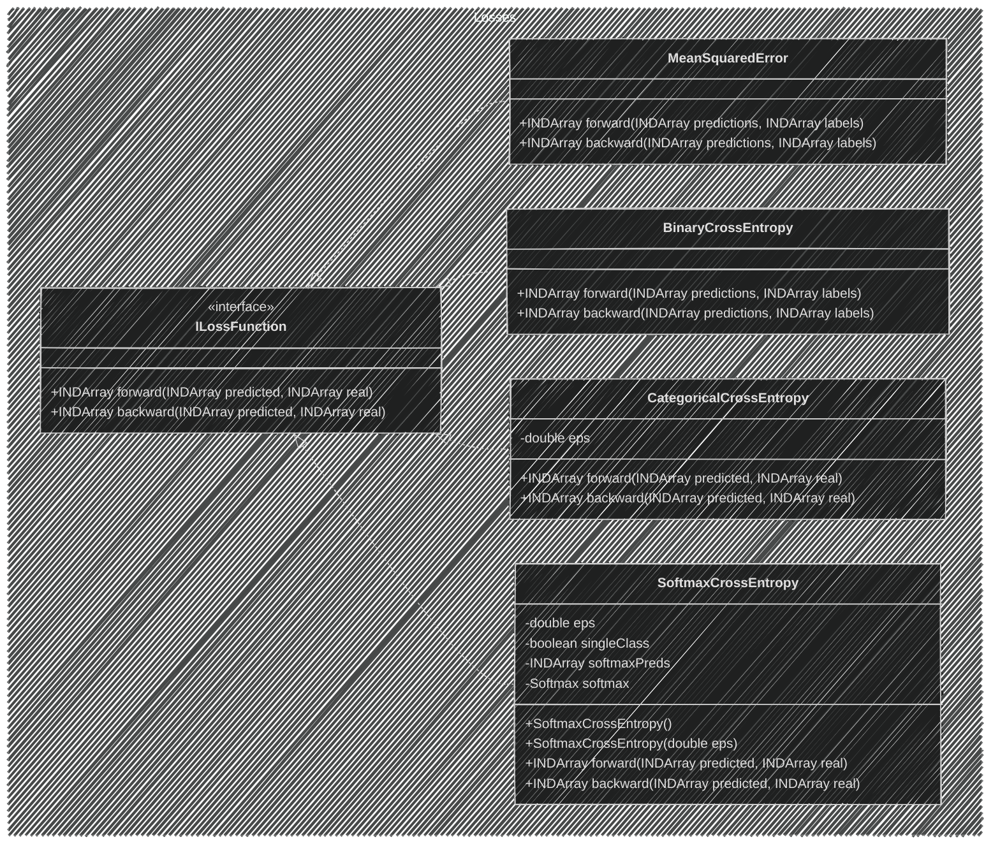

```mermaid
---
config:
  look: handDrawn
  theme: dark
---
classDiagram
    namespace Losses {
        class ILossFunction {
            <<interface>>
            +INDArray forward(INDArray predicted, INDArray real)
            +INDArray backward(INDArray predicted, INDArray real)
        }

        %% Concrete classes implementing ILossFunction
        class MeanSquaredError {
            +INDArray forward(INDArray predictions, INDArray labels)
            +INDArray backward(INDArray predictions, INDArray labels)
        }

        class BinaryCrossEntropy {
            +INDArray forward(INDArray predictions, INDArray labels)
            +INDArray backward(INDArray predictions, INDArray labels)
        }

        class CategoricalCrossEntropy {
            -double eps
            +INDArray forward(INDArray predicted, INDArray real)
            +INDArray backward(INDArray predicted, INDArray real)
        }

        class SoftmaxCrossEntropy {
            -double eps
            -boolean singleClass
            -INDArray softmaxPreds
            -Softmax softmax
            +SoftmaxCrossEntropy()
            +SoftmaxCrossEntropy(double eps)
            +INDArray forward(INDArray predicted, INDArray real)
            +INDArray backward(INDArray predicted, INDArray real)
        }
    }

    ILossFunction <|.. MeanSquaredError
    ILossFunction <|.. BinaryCrossEntropy
    ILossFunction <|.. CategoricalCrossEntropy
    ILossFunction <|.. SoftmaxCrossEntropy
``` 