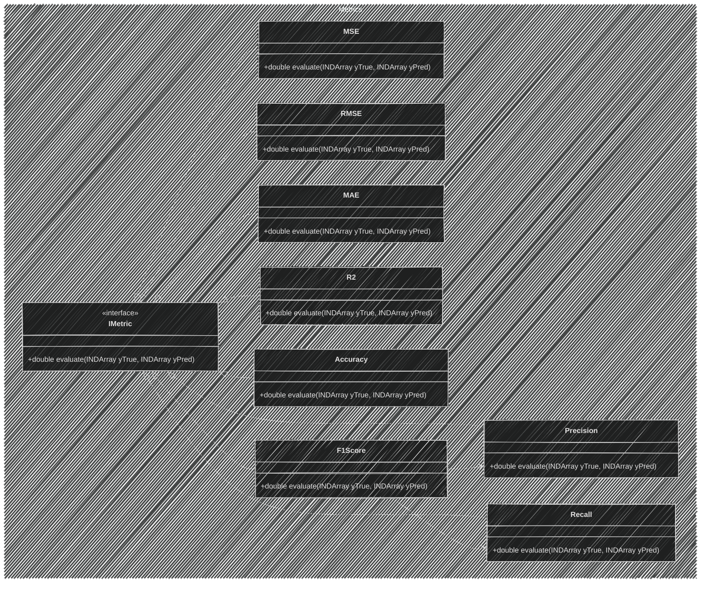

```mermaid
---
config:
  look: handDrawn
  theme: dark
---
classDiagram
    namespace Metrics {
        class IMetric {
            <<interface>>
            +double evaluate(INDArray yTrue, INDArray yPred)
        }
        
        class MSE {
            +double evaluate(INDArray yTrue, INDArray yPred)
        }
        
        class RMSE {
            +double evaluate(INDArray yTrue, INDArray yPred)
        }
        
        class MAE {
            +double evaluate(INDArray yTrue, INDArray yPred)
        }
        
        class R2 {
            +double evaluate(INDArray yTrue, INDArray yPred)
        }
        
        class Accuracy {
            +double evaluate(INDArray yTrue, INDArray yPred)
        }

        class Precision {
            +double evaluate(INDArray yTrue, INDArray yPred)
        }
        
        class Recall {
            +double evaluate(INDArray yTrue, INDArray yPred)
        }
        
        class F1Score {
            +double evaluate(INDArray yTrue, INDArray yPred)
        }
    }

    IMetric <|.. MSE
    IMetric <|.. RMSE
    IMetric <|.. MAE
    IMetric <|.. R2 
    IMetric <|.. Accuracy 
    IMetric <|.. Precision 
    IMetric <|.. Recall 
    IMetric <|.. F1Score

    F1Score ..> Precision 
    F1Score ..> Recall
``` 