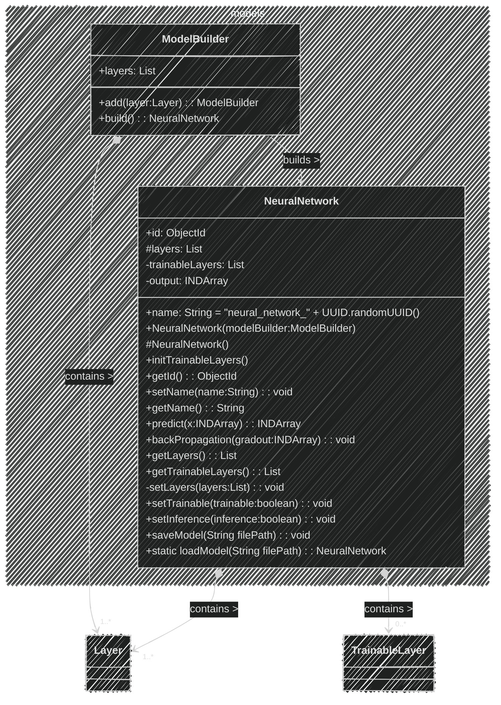

```mermaid
---
config:
  look: handDrawn
  theme: dark
---
classDiagram
    namespace models {
        class ModelBuilder {
            +layers: List<Layer>
            +add(layer:Layer): ModelBuilder
            +build(): NeuralNetwork
        }
        class NeuralNetwork {
            +id: ObjectId
            +name: String = "neural_network_" + UUID.randomUUID()
            #layers: List<Layer>
            -trainableLayers: List<TrainableLayer>
            -output: INDArray
            +NeuralNetwork(modelBuilder:ModelBuilder)
            #NeuralNetwork()
            +initTrainableLayers()
            +getId(): ObjectId
            +setName(name:String): void
            +getName(): String
            +predict(x:INDArray): INDArray
            +backPropagation(gradout:INDArray): void
            +getLayers(): List<Layer>
            +getTrainableLayers(): List<TrainableLayer>
            -setLayers(layers:List<Layer>): void
            +setTrainable(trainable:boolean): void
            +setInference(inference:boolean): void
            +saveModel(String filePath): void
            +static loadModel(String filePath): NeuralNetwork
        }
    }
    
    %% Relationships for models namespace
    ModelBuilder --> NeuralNetwork: builds >
    ModelBuilder *--> "1..*" Layer: contains >
    NeuralNetwork *--> "1..*" Layer: contains >
    NeuralNetwork *--> "0..*" TrainableLayer: contains >
``` 