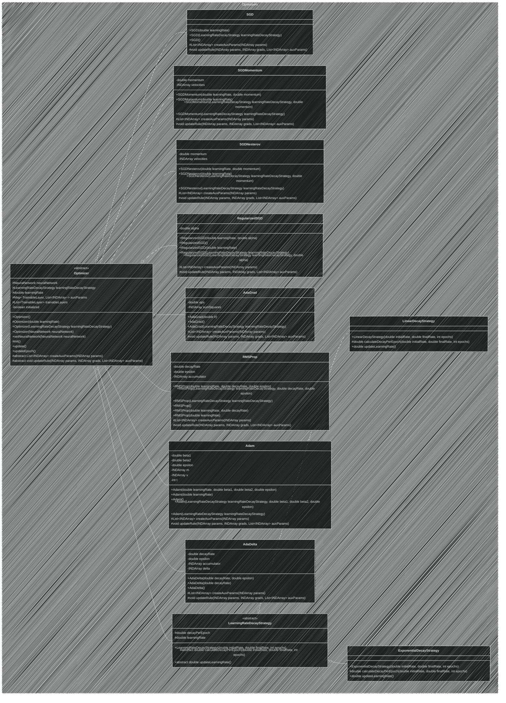

```mermaid
---
config:
  look: handDrawn
  theme: dark
---
classDiagram
    namespace Optimizers {
        class Optimizer {
            <<abstract>>
            #NeuralNetwork neuralNetwork
            #LearningRateDecayStrategy learningRateDecayStrategy
            #double learningRate
            #Map~TrainableLayer, List~INDArray~~ auxParams
            #List~TrainableLayer~ trainableLayers
            -boolean initialized
            
            +Optimizer()
            #Optimizer(double learningRate)
            +Optimizer(LearningRateDecayStrategy learningRateDecayStrategy)
            +Optimizer(NeuralNetwork neuralNetwork)
            +setNeuralNetwork(NeuralNetwork neuralNetwork)
            #init()
            +update()
            +updateEpoch()
            #abstract List~INDArray~ createAuxParams(INDArray params)
            #abstract void updateRule(INDArray params, INDArray grads, List~INDArray~ auxParams)
        }
        
        %% Learning Rate Decay Strategies
        class LearningRateDecayStrategy {
            <<abstract>>
            #double decayPerEpoch
            #double learningRate
            
            +LearningRateDecayStrategy(double initialRate, double finalRate, int epochs)
            #abstract double calculateDecayPerEpoch(double initialRate, double finalRate, int epochs)
            +abstract double updateLearningRate()
        }
        
        class ExponentialDecayStrategy {
            +ExponentialDecayStrategy(double initialRate, double finalRate, int epochs)
            #double calculateDecayPerEpoch(double initialRate, double finalRate, int epochs)
            +double updateLearningRate()
        }

        class LinearDecayStrategy {
            +LinearDecayStrategy(double initialRate, double finalRate, int epochs)
            #double calculateDecayPerEpoch(double initialRate, double finalRate, int epochs)
            +double updateLearningRate()
        }
        
        %% SGD Optimizers
        class SGD {
            +SGD(double learningRate)
            +SGD(LearningRateDecayStrategy learningRateDecayStrategy)
            +SGD()
            #List~INDArray~ createAuxParams(INDArray params)
            #void updateRule(INDArray params, INDArray grads, List~INDArray~ auxParams)
        }
        
        class SGDMomentum {
            -double momentum
            -INDArray velocities
            
            +SGDMomentum(double learningRate, double momentum)
            +SGDMomentum(double learningRate)
            +SGDMomentum(LearningRateDecayStrategy learningRateDecayStrategy, double momentum)
            +SGDMomentum(LearningRateDecayStrategy learningRateDecayStrategy)
            #List~INDArray~ createAuxParams(INDArray params)
            #void updateRule(INDArray params, INDArray grads, List~INDArray~ auxParams)
        }
        
        class SGDNesterov {
            -double momentum
            -INDArray velocities
            
            +SGDNesterov(double learningRate, double momentum)
            +SGDNesterov(double learningRate)
            +SGDNesterov(LearningRateDecayStrategy learningRateDecayStrategy, double momentum)
            +SGDNesterov(LearningRateDecayStrategy learningRateDecayStrategy)
            #List~INDArray~ createAuxParams(INDArray params)
            #void updateRule(INDArray params, INDArray grads, List~INDArray~ auxParams)
        }
        
        class RegularizedSGD {
            -double alpha
            
            +RegularizedSGD(double learningRate, double alpha)
            +RegularizedSGD()
            +RegularizedSGD(double learningRate)
            +RegularizedSGD(LearningRateDecayStrategy learningRateDecayStrategy)
            +RegularizedSGD(LearningRateDecayStrategy learningRateDecayStrategy, double alpha)
            #List~INDArray~ createAuxParams(INDArray params)
            #void updateRule(INDArray params, INDArray grads, List~INDArray~ auxParams)
        }
        
        %% Adaptive optimizers
        class AdaGrad {
            -double eps
            -INDArray sumSquares
            
            +AdaGrad(double lr)
            +AdaGrad()
            +AdaGrad(LearningRateDecayStrategy learningRateDecayStrategy)
            #List~INDArray~ createAuxParams(INDArray params)
            #void updateRule(INDArray params, INDArray grads, List~INDArray~ auxParams)
        }
        
        class RMSProp {
            -double decayRate
            -double epsilon
            -INDArray accumulator
            
            +RMSProp(double learningRate, double decayRate, double epsilon)
            +RMSProp(LearningRateDecayStrategy learningRateDecayStrategy, double decayRate, double epsilon)
            +RMSProp(LearningRateDecayStrategy learningRateDecayStrategy)
            +RMSProp()
            +RMSProp(double learningRate, double decayRate)
            +RMSProp(double learningRate)
            #List~INDArray~ createAuxParams(INDArray params)
            #void updateRule(INDArray params, INDArray grads, List~INDArray~ auxParams)
        }
        
        class Adam {
            -double beta1
            -double beta2
            -double epsilon
            -INDArray m
            -INDArray v
            -int t
            
            +Adam(double learningRate, double beta1, double beta2, double epsilon)
            +Adam(double learningRate)
            +Adam()
            +Adam(LearningRateDecayStrategy learningRateDecayStrategy, double beta1, double beta2, double epsilon)
            +Adam(LearningRateDecayStrategy learningRateDecayStrategy)
            #List~INDArray~ createAuxParams(INDArray params)
            #void updateRule(INDArray params, INDArray grads, List~INDArray~ auxParams)
        }
        
        class AdaDelta {
            -double decayRate
            -double epsilon
            -INDArray accumulator
            -INDArray delta
            
            +AdaDelta(double decayRate, double epsilon)
            +AdaDelta(double decayRate)
            +AdaDelta()
            #List~INDArray~ createAuxParams(INDArray params)
            #void updateRule(INDArray params, INDArray grads, List~INDArray~ auxParams)
        }
    }

    Optimizer <|-- SGD
    Optimizer <|-- SGDMomentum
    Optimizer <|-- SGDNesterov
    Optimizer <|-- RegularizedSGD
    Optimizer <|-- AdaGrad
    Optimizer <|-- RMSProp
    Optimizer <|-- Adam
    Optimizer <|-- AdaDelta
    
    LearningRateDecayStrategy <|-- LinearDecayStrategy
    LearningRateDecayStrategy <|-- ExponentialDecayStrategy
    
    Optimizer o-- LearningRateDecayStrategy
``` 