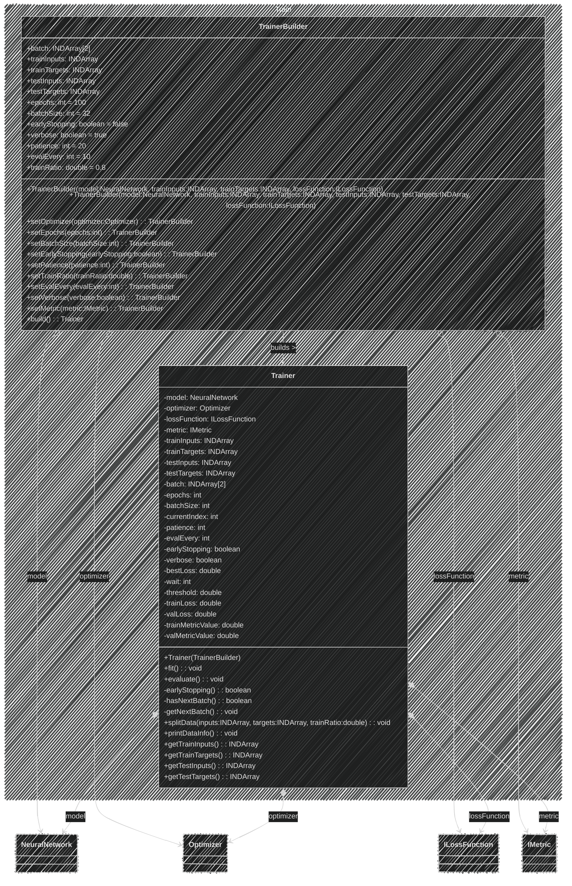

```mermaid
---
config:
  look: handDrawn
  theme: dark
---
classDiagram
    namespace Train {
        class TrainerBuilder {
            +batch: INDArray[2]
            +trainInputs: INDArray
            +trainTargets: INDArray
            +testInputs: INDArray
            +testTargets: INDArray
            +epochs: int = 100
            +batchSize: int = 32
            +earlyStopping: boolean = false
            +verbose: boolean = true
            +patience: int = 20
            +evalEvery: int = 10
            +trainRatio: double = 0.8
            
            +TrainerBuilder(model:NeuralNetwork, trainInputs:INDArray, trainTargets:INDArray, lossFunction:ILossFunction)
            +TrainerBuilder(model:NeuralNetwork, trainInputs:INDArray, trainTargets:INDArray, testInputs:INDArray, testTargets:INDArray, lossFunction:ILossFunction)
            +setOptimizer(optimizer:Optimizer): TrainerBuilder
            +setEpochs(epochs:int): TrainerBuilder
            +setBatchSize(batchSize:int): TrainerBuilder
            +setEarlyStopping(earlyStopping:boolean): TrainerBuilder
            +setPatience(patience:int): TrainerBuilder
            +setTrainRatio(trainRatio:double): TrainerBuilder
            +setEvalEvery(evalEvery:int): TrainerBuilder
            +setVerbose(verbose:boolean): TrainerBuilder
            +setMetric(metric:IMetric): TrainerBuilder
            +build(): Trainer
        }
        
        class Trainer {
            -model: NeuralNetwork
            -optimizer: Optimizer
            -lossFunction: ILossFunction
            -metric: IMetric
            -trainInputs: INDArray
            -trainTargets: INDArray
            -testInputs: INDArray
            -testTargets: INDArray
            -batch: INDArray[2]
            -epochs: int
            -batchSize: int
            -currentIndex: int
            -patience: int
            -evalEvery: int
            -earlyStopping: boolean
            -verbose: boolean
            -bestLoss: double
            -wait: int
            -threshold: double
            -trainLoss: double
            -valLoss: double
            -trainMetricValue: double
            -valMetricValue: double
            
            +Trainer(TrainerBuilder)
            +fit(): void
            +evaluate(): void
            -earlyStopping(): boolean
            -hasNextBatch(): boolean
            -getNextBatch(): void
            +splitData(inputs:INDArray, targets:INDArray, trainRatio:double): void
            +printDataInfo(): void
            +getTrainInputs(): INDArray
            +getTrainTargets(): INDArray
            +getTestInputs(): INDArray
            +getTestTargets(): INDArray
        }
    }
    
    %% Relationships for Train namespace
    TrainerBuilder --> Trainer: builds >
    TrainerBuilder o--> NeuralNetwork: model
    TrainerBuilder o--> ILossFunction: lossFunction
    TrainerBuilder o--> IMetric: metric
    TrainerBuilder o--> Optimizer: optimizer
    
    Trainer *--> NeuralNetwork: model
    Trainer *--> Optimizer: optimizer
    Trainer *--> ILossFunction: lossFunction
    Trainer *--> IMetric: metric
``` 